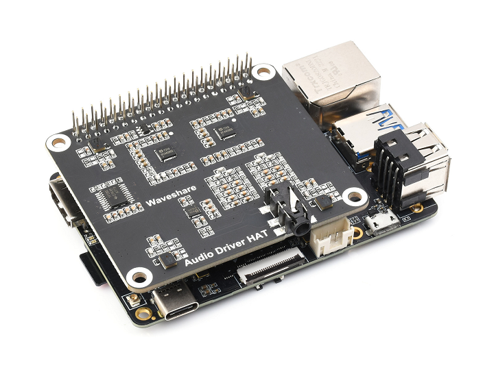

English| [简体中文](./README_cn.md)

# Function Introduction

The intelligent voice chat robot recognizes the user's voice content, then calls the OpenAI API to get a reply, and finally plays back the reply, achieving the function of voice chatting between users and robots.

# Bill of Materials

| Robot Name | Manufacturer | Reference Link                                               |
| :--------- | ----------- | ----------------------------------------------------------- |
| RDK X3     | Multiple    | [Click to Jump](https://developer.horizon.cc/rdkx3)         |
| Microphone Board | Waveshare | [Click to Jump](https://www.waveshare.net/shop/Audio-Driver-HAT.htm) |

# Instructions

## Preparation

Before experiencing, the following basic conditions need to be met:

- The Horizon RDK has been burnt with the Ubuntu 20.04 system image provided by Horizon.
- Owns an OpenAI API key and can access the OpenAI API normally.
- The audio board is correctly connected to the RDK X3, and headphones or speakers are connected to the headphone interface.

## Robot Assembly

1. Connect the microphone board to the Horizon RDK X3 40PIN GPIO interface, the physical connection looks like the following image:

    

2. Connect headphones or speakers to the headphone interface.

## Install the Function Package

After booting up the RDK X3, connect to the robot via terminal SSH or VNC, copy and run the following commands on the RDK system to install the relevant Node.

```bash
sudo apt update
sudo apt install -y tros-chat-robot
```

## Run the Intelligent Chat Robot

1. Copy the configuration files and load the audio driver.

    ```shell
    # Copy the configuration files needed for running the examples from the installation path of tros.b, you can ignore if already copied
    cp -r /opt/tros/lib/hobot_audio/config/ .
    cp -r /opt/tros/lib/hobot_gpt/config ./

    # Load the audio driver, only need to load once after device startup
    bash config/audio.sh
    ```
Note: Ensure no other audio devices are connected when loading the audio driver, such as USB microphones or USB cameras with microphone functions, as this may cause the application to fail to open the audio device and report an error and exit.

2. Modify the configuration file, only need to modify once
   1. Modify *config/audio_config.json*, set the `asr_mode` field to `1`.
   2. Modify *config/gpt_config.json*, set the `api_key` field to a valid OpenAI API key.

3. Download the TTS model
    When running for the first time, download the TTS model file and unzip it, detailed commands as follows:

    ```bash
    wget http://sunrise.horizon.cc//tts-model/tts_model.tar.gz
    sudo tar -xf tts_model.tar.gz -C /opt/tros/lib/hobot_tts/
    ```

4. Configure the tros.b environment and start the application

    ```shell
    # Configure the tros.b environment
    source /opt/tros/setup.bash

    # Suppress debug print information
    export GLOG_minloglevel=3

    # Start the launch file and make sure the network can access the OpenAI API before running
    ros2 launch chat_robot chat_robot.launch.py
    ```

    After successful startup, users can wake up the robot by saying the wake-up phrase "Hello Horizon", then proceed to chat with the robot, and shortly after the robot will respond with voice. Every time you chat with the robot, you need to wake it up using the wake-up phrase "Hello Horizon".

# Interface Description

## Topics

| Name           | Message Type                                                                                                             | Description                         |
| -------------- | ------------------------------------------------------------------------------------------------------------------------ | ----------------------------------- |
| /audio_smart   | [audio_msg/msg/SmartAudioData](https://github.com/HorizonRDK/hobot_msgs/blob/develop/audio_msg/msg/SmartAudioData.msg) | Publishes intelligent results of smart audio processing |
| /audio_asr     | std_msgs/msg/String                                                                                                      | Publishes ASR recognition results    |
| /tts_text      | std_msgs/msg/String                                                                                                      | Publishes GPT response results      |

# FAQ

1. No response from the robot?

- Ensure that the audio device is properly connected and headphones or speakers are connected
- Confirm if the audio driver is loaded
- Verify if there were any audio devices connected before loading the audio driver
- Confirm that the `asr_mode` field in *config/audio_config.json* is set to `1`
- Verify that the `api_key` field in *config/gpt_config.json* is set correctly
- Check if the network can access the OpenAI API
